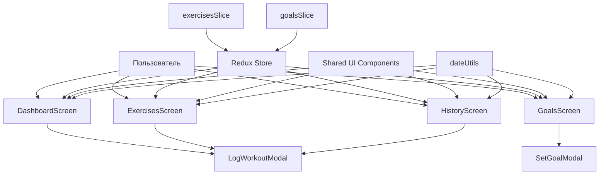

# Презентация приложения Gym VOVA

Это приложение — мобильный трекер тренировок и целей. Оно помогает вести историю упражнений, создавать цели и следить за прогрессом.

## 1. Что делает приложение

Gym VOVA позволяет пользователю:
- добавлять результаты тренировок;
- видеть статистику за сегодня;
- создавать и отслеживать цели;
- смотреть историю выполненных упражнений;
- редактировать и удалять уже сохранённые записи.

---

## 2. Диаграмма структуры приложения

---

## 3. Главное меню и интерфейс

### 3.1 Экран Dashboard
Это главный экран приложения.

Что там есть:
- приветствие пользователя;
- дата сегодняшнего дня;
- карточки со статистикой:
  - повторения;
  - подходы;
  - количество записей;
- быстрый старт для добавления упражнения;
- блок “Сегодня” с последними записями;
- активные цели.

Интерфейс:
- сверху — приветствие и логотип VOVA;
- ниже — карточки статистики;
- далее — быстрые кнопки упражнений;
- внизу — список сегодняшних записей.

### 3.2 Экран Exercises
Это экран для выбора упражнений и добавления результата.

Что там есть:
- список упражнений;
- карточки с названием упражнения и иконкой;
- модальное окно для ввода:
  - повторений;
  - подходов;
  - заметки;
  - даты.

Интерфейс:
- список карточек упражнений;
- при нажатии открывается форма добавления.

### 3.3 Экран Goals
Это экран для постановки целей.

Что там есть:
- список целей;
- карточки целей с прогрессом;
- возможность создать новую цель;
- выбор упражнения, целевого количества и периода.

Интерфейс:
- карточки с целью;
- прогресс-бар;
- кнопка добавления новой цели.

### 3.4 Экран History
Это экран истории тренировок.

Что там есть:
- календарь;
- навигация по датам;
- список тренировок за выбранный день;
- возможность:
  - редактировать запись;
  - удалять запись;
  - смотреть заметку.

Интерфейс:
- сверху — переключение дат;
- в середине — календарь;
- ниже — карточки тренировок выбранного дня.

---

## 4. Как устроена логика приложения

### 4.1 Хранение данных
Для хранения данных используется Redux.

Основные части:
- exercisesSlice — отвечает за упражнения и записи тренировок;
- goalsSlice — отвечает за цели.

### 4.2 Состояние приложения
Приложение хранит:
- упражнения;
- записи тренировок;
- цели.

Из-за этого данные сохраняются между переходами по экрану.

### 4.3 Список основных действий
Пользователь может:
- добавить тренировку;
- изменить тренировку;
- удалить тренировку;
- создать цель;
- изменить цель;
- удалить цель;
- просмотреть историю за любую дату.

---

## 5. Основные модели данных

### Exercise
Описывает упражнение:
- id;
- название;
- иконка;
- тип;
- единица измерения;
- пользовательское или стандартное.

### WorkoutLog
Описывает запись тренировки:
- id;
- id упражнения;
- название упражнения;
- дата;
- повторения;
- подходы;
- заметка;
- время создания и обновления.

### Goal
Описывает цель:
- id;
- id упражнения;
- название упражнения;
- целевое количество;
- период;
- даты старта и окончания;
- активность цели.

---

## 6. Как пользователь проходит по приложению

1. Открывается главный экран Dashboard.
2. Пользователь добавляет запись тренировки.
3. Запись сохраняется и появляется в истории.
4. Пользователь может посмотреть, сколько он сделал сегодня.
5. На экране целей можно поставить новую цель.
6. На экране истории можно выбрать дату и посмотреть все тренировки за неё.

---

## 7. Техническая часть проекта

### Используемые технологии
- React Native;
- Expo Router;
- Redux Toolkit;
- React Native UI-компоненты;
- date-fns для работы с датами.

### Архитектура
Проект разделён на слои:
- screens — экраны приложения;
- components — переиспользуемые элементы интерфейса;
- hooks — логика работы с данными;
- store — состояние приложения;
- shared — общие компоненты и утилиты.

---

## 8. Где удобно смотреть эту презентацию

Этот код диаграммы поддерживается в:
- VS Code (Markdown Preview);
- GitHub;
- Obsidian;
- Mermaid Live Editor;
- Notion.

Чтобы посмотреть диаграмму в VS Code:
1. открой этот файл;
2. нажми Ctrl+Shift+V;
3. выбери Markdown Preview.

---

## 9. Краткий вывод

Gym VOVA — это удобное мобильное приложение для:
- отслеживания тренировок;
- контроля целей;
- ведения истории активности;
- простого и понятного интерфейса.

Оно объединяет в себе экран статистики, экран упражнений, экран целей и экран истории, чтобы пользователь мог комфортно вести свой прогресс.
